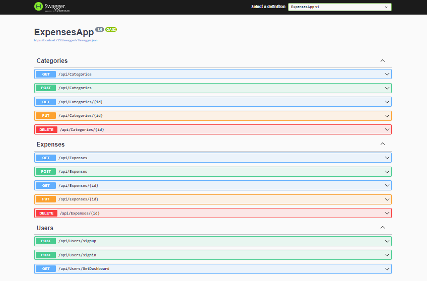

# Expenses Backend
this is .net core API Application allows you to record your expenses while arranging them in certain categories and also displaying a report .

You can check this link to get the frontend part https://github.com/Ahmed-Diab/ExpensesFrontend.git

## Using 
- make sure you install .net core 6.
- make sure you install MSSQL 2019.
- Clone Backend `git clone https://github.com/Ahmed-Diab/ExpensesBackend.git` .
- Clone Frontend `git clone https://github.com/Ahmed-Diab/ExpensesFrontend.git` .

## Images

